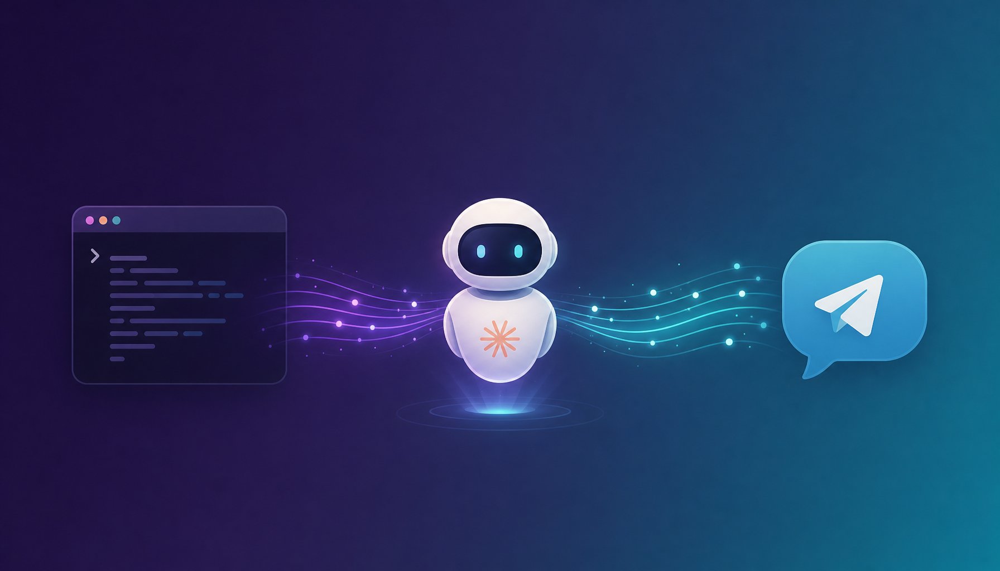

<div align="center">



# claude-bridge

**A persistent Claude Code agent that lives in your terminal and your Telegram.**

[](https://nodejs.org/)
[](https://www.typescriptlang.org/)
[](#)
[](#)
[](#)

</div>

---

Wraps `claude --print --output-format stream-json` in a long-lived Node daemon. Uses your Claude **subscription**, not the API key. Every skill, plugin, slash command, MCP server, and agent your local `claude` CLI sees — claude-bridge sees too.

## Highlights

| | |
|---|---|
| **Two channels in one daemon** | Local terminal + Telegram bot, sharing the same agent core. |
| **Persistent sessions** | Each user gets a stable UUID. Conversations survive restarts. |
| **Live Telegram streaming** | One message is edited in place as Claude responds — no chunk spam. |
| **Proactive triggers** | Cron-driven prompts fire on schedule and push to terminal, Telegram, or both. |
| **Subscription-powered** | No API key bill. Auth flows through the `claude` CLI you already use. |
| **Portable** | Same setup runs on Windows, macOS, Linux, and any VPS. |

## Architecture

```
┌──────────────┐
│   Terminal   │──┐
└──────────────┘  │     ┌──────────────────────┐    ┌─────────────────────┐
                  ├────▶│  Agent Orchestrator  │───▶│  claude --print     │
┌──────────────┐  │     │                      │    │  (subscription)     │
│ Telegram Bot │──┘     │  - session manager   │    └─────────────────────┘
└──────────────┘        │  - per-user UUIDs    │           │
                        └──────────────────────┘           ▼
                                  ▲                ┌────────────────┐
                                  │                │ stream-json    │
                        ┌─────────┴──────────┐     │ stdout         │
                        │ Cron Scheduler     │     └────────────────┘
                        │ (proactive prompts)│
                        └────────────────────┘
```

Full details: [`docs/system-architecture.md`](docs/system-architecture.md).

## Quick start

```bash
# 1. install
npm install

# 2. configure
cp .env.example .env
# fill in TELEGRAM_BOT_TOKEN, TELEGRAM_ALLOWED_USER_IDS

# 3. ensure claude CLI is logged in via subscription
claude auth login

# 4. dev run (terminal + Telegram)
npm run start:dev

# 5. production daemon
npm run build
npm run pm2:start
npm run pm2:logs
```

Bot creation walkthrough: [`docs/setup-guide.md`](docs/setup-guide.md).

## Channels

### Terminal

Type prompts directly.

| Command   | Effect                              |
|-----------|-------------------------------------|
| `/new`    | Drop current conversation, restart  |
| `/status` | Show session key                    |
| `/help`   | List commands                       |
| `/exit`   | Stop daemon                         |

### Telegram

Whitelist your Telegram user ID via `TELEGRAM_ALLOWED_USER_IDS`, then DM the bot.

| Command   | Effect                |
|-----------|-----------------------|
| `/new`    | Fresh conversation    |
| `/status` | Session info          |
| `/help`   | Help menu             |

Each Telegram user gets a separate session — or all share one if `SESSION_MODE=shared`.

The bot also supports **media-back markers** so Claude can send screenshots, documents, videos, and audio through Telegram:

```
[[SEND_PHOTO: C:\path\to\image.png | optional caption]]
[[SEND_DOCUMENT: ./report.pdf]]
[[SEND_VIDEO: clip.mp4]]
[[SEND_AUDIO: voice.ogg]]
```

Markers are stripped from the user-visible reply.

## Proactive triggers

Inline JSON in `.env`:

```env
PROACTIVE_TRIGGERS=[{"name":"morning-check","cron":"0 9 * * *","prompt":"Summarise overnight server logs"}]
```

Or point to a file:

```env
PROACTIVE_TRIGGERS=./triggers.json
```

Results push to whichever channel `PROACTIVE_NOTIFY` names — `terminal`, `telegram`, or `both`.

## Deployment

### Local (Windows / macOS / Linux)

```bash
npm install -g pm2
npm run build
pm2 start ecosystem.config.cjs
pm2 save
pm2 startup     # optional — auto-start on boot
```

### Cloud / VPS

Identical commands. Pre-flight:

1. `claude` CLI installed and `claude auth login` completed under the same user
2. `.env` present in the project root
3. `CLAUDE_WORK_DIR` directory exists and is the path you want Claude to operate in

Tested on Node 20 LTS.

## Security note

`CLAUDE_PERMISSION_MODE=bypassPermissions` means Claude can read/write any file under `CLAUDE_WORK_DIR` and run any shell command without confirmation. Run only inside trusted directories. Whitelist Telegram IDs carefully — anyone on the list gets full shell access through your machine.

## License

MIT.
